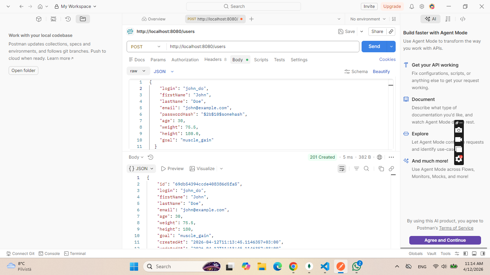
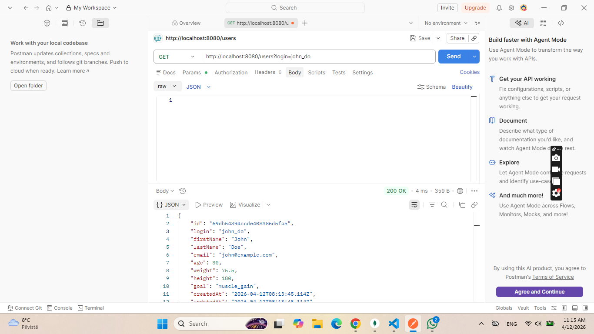
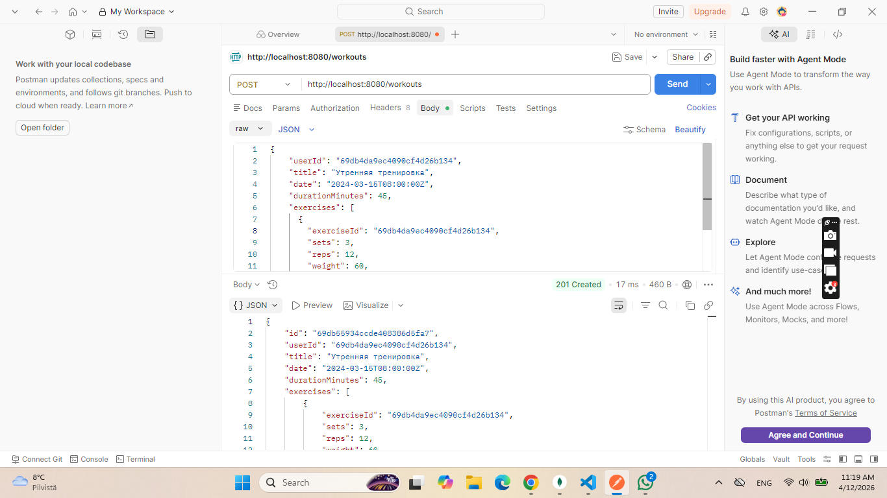
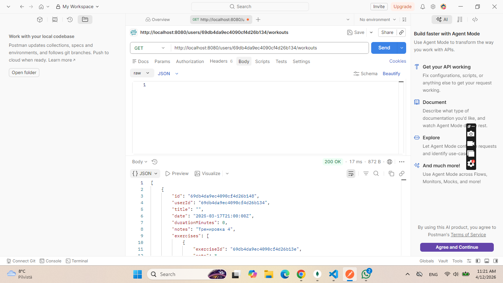
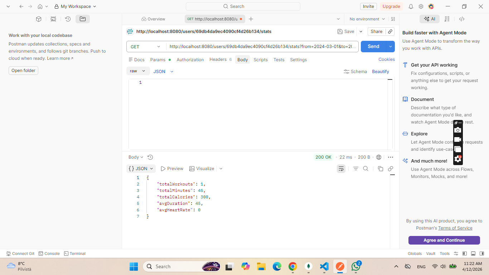

# Фитнес-трекер — Домашнее задание 04

API сервис для отслеживания тренировок, построенный на **Go** + **MongoDB**.

## Структура проекта

```
.
├── cmd/api/main.go       # Исходный код API
├── data.js               # Тестовые данные (seed)
├── validation.js         # Валидация схем MongoDB
├── queries.js            # Примеры CRUD запросов
├── schema_design.md      # Документация по проектированию БД
├── go.mod                # Go модуль
├── Dockerfile            # Сборка API
└── docker-compose.yml    # Запуск всего стека
```

---

## Запуск

### Вариант 1: Docker Compose (рекомендуется)

```bash
# Запуск MongoDB + API
docker compose up -d

# Проверка логов
docker compose logs -f api

# Остановка
docker compose down
```

MongoDB будет доступна на `localhost:27017`.  
API — на `http://localhost:8080`.

При первом запуске MongoDB автоматически выполнит `data.js` и `validation.js`
из директории `/docker-entrypoint-initdb.d`.

### Вариант 2: Только MongoDB (для разработки)

```bash
# Запуск только MongoDB
docker compose up -d mongo

# Заполнить БД тестовыми данными
mongosh fitness_tracker data.js

# Применить валидацию схем
mongosh fitness_tracker validation.js

# Запустить API локально
MONGO_URI=mongodb://localhost:27017/fitness_tracker go run ./cmd/api
```

### Выполнение запросов из queries.js

```bash
mongosh fitness_tracker queries.js
```

---

## API Эндпоинты

| Метод | Путь | Описание |
|-------|------|----------|
| `POST` | `/users` | Создание нового пользователя |
| `GET` | `/users?login=xxx` | Поиск пользователя по логину |
| `GET` | `/users?firstName=Ив&lastName=Пет` | Поиск по маске имя/фамилия |
| `GET` | `/users/{id}/workouts` | История тренировок пользователя |
| `GET` | `/users/{id}/stats?from=2024-03-01&to=2024-03-31` | Статистика за период |
| `POST` | `/exercises` | Создание упражнения |
| `GET` | `/exercises` | Список всех упражнений |
| `GET` | `/exercises?category=strength` | Упражнения по категории |
| `POST` | `/workouts` | Создание тренировки |
| `POST` | `/workouts/{id}/exercises` | Добавление упражнения в тренировку |

---

## Примеры запросов (curl)

### Создание пользователя
```bash
curl -X POST http://localhost:8080/users \
  -H "Content-Type: application/json" \
  -d '{
    "login": "john_doe",
    "firstName": "John",
    "lastName": "Doe",
    "email": "john@example.com",
    "passwordHash": "$2b$10$somehash",
    "age": 30,
    "weight": 75.5,
    "height": 180.0,
    "goal": "muscle_gain"
  }'
```

### Поиск по логину
```bash
curl "http://localhost:8080/users?login=ivan_petrov"
```

### Поиск по маске имени
```bash
curl "http://localhost:8080/users?firstName=Ив"
```

### Создание тренировки
```bash
curl -X POST http://localhost:8080/workouts \
  -H "Content-Type: application/json" \
  -d '{
    "userId": "<USER_OBJECT_ID>",
    "title": "Утренняя тренировка",
    "date": "2024-03-15T08:00:00Z",
    "durationMinutes": 45,
    "exercises": [
      {
        "exerciseId": "<EXERCISE_OBJECT_ID>",
        "sets": 3,
        "reps": 12,
        "weight": 60,
        "completed": false
      }
    ],
    "totalCaloriesBurned": 300
  }'
```

### История тренировок пользователя
```bash
curl "http://localhost:8080/users/<USER_ID>/workouts"
```

### Статистика за период
```bash
curl "http://localhost:8080/users/<USER_ID>/stats?from=2024-03-01&to=2024-03-31"
```

---

## Технологии

- **Go 1.22** — стандартная библиотека `net/http` с поддержкой `PathValue`
- **MongoDB 7.0** — документная база данных
- **mongo-driver v1.15** — официальный Go драйвер MongoDB
- **Docker / Docker Compose** — контейнеризация

---

## Коллекции MongoDB

| Коллекция | Описание | Документов (тест) |
|-----------|----------|-------------------|
| `users` | Пользователи | 5 |
| `exercises` | Справочник упражнений | 11 |
| `workouts` | Тренировки | 11 |

Подробнее о структуре — в файле `schema_design.md`.
