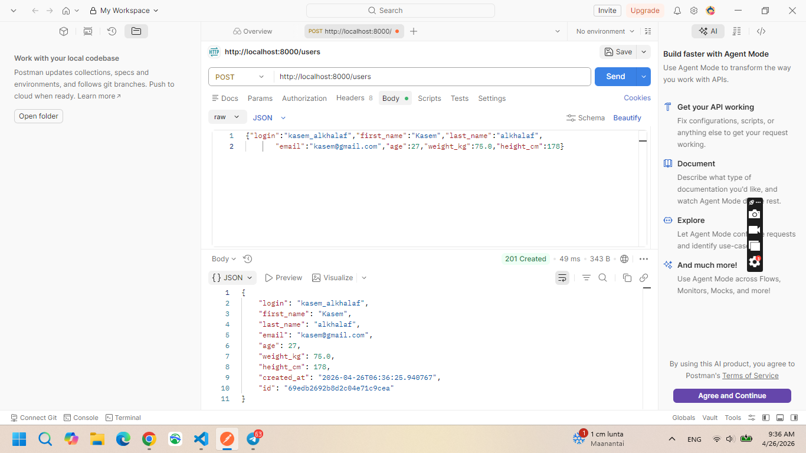
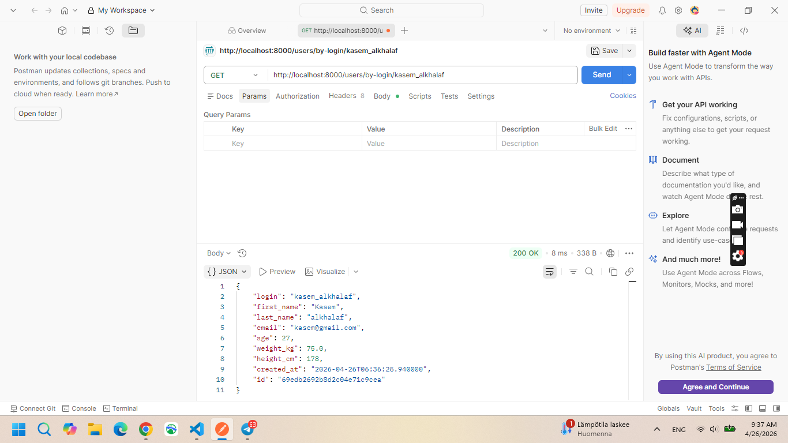
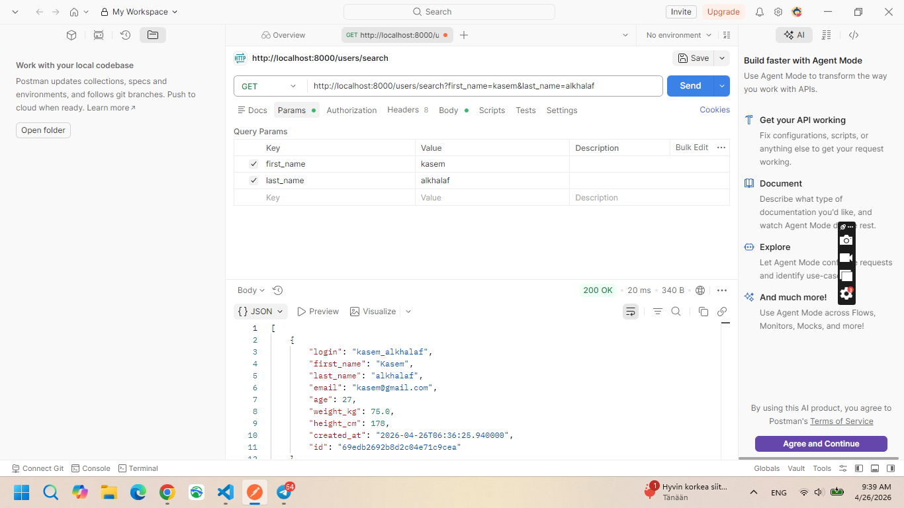
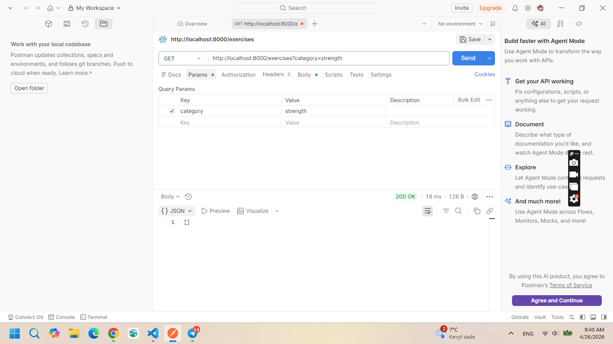
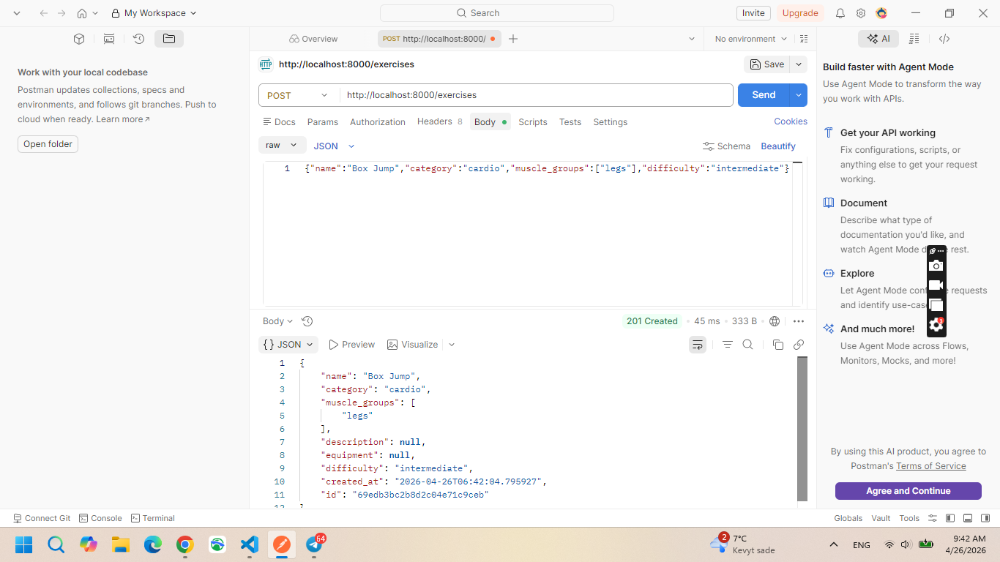
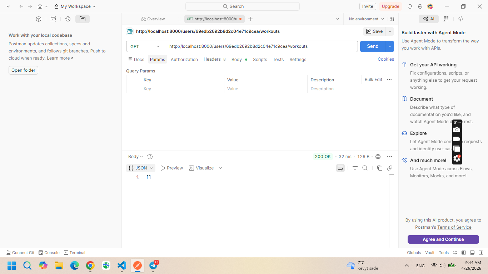
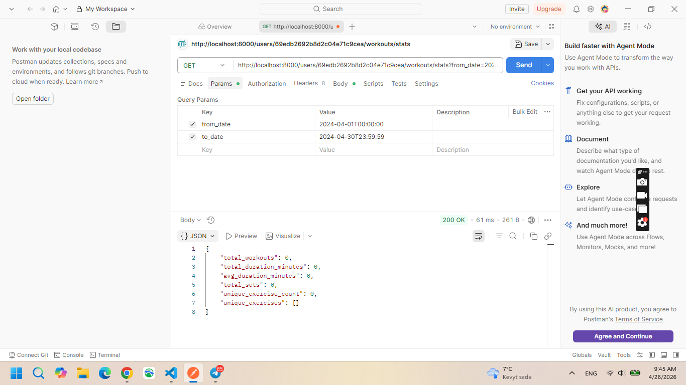

# Fitness Tracker — Домашнее задание 04

**Вариант 14 — Фитнес-трекер**  
Стек: Python · FastAPI · MongoDB · Motor · Docker

---

## Структура проекта

```
fitness-tracker/
├── app/
│   ├── main.py            # FastAPI приложение
│   ├── requirements.txt
│   └── Dockerfile
├── schema_design.md       # Документная модель + обоснование embedded/references
├── data.js                # Тестовые данные (10+ документов в каждой коллекции)
├── queries.js             # CRUD запросы + агрегации
├── validation.js          # JSON Schema валидация + тесты
├── docker-compose.yml
└── README.md
```

---

## Быстрый старт

### 1. Запуск через Docker Compose

```bash
docker compose up --build
```

MongoDB стартует на `localhost:27017`, API — на `localhost:8000`.  
Тестовые данные загружаются автоматически при первом запуске через `data.js`.

### 2. Документация API

После запуска откройте: <http://localhost:8000/docs>

---

## Ручная загрузка данных и запросов

Если MongoDB запущена отдельно:

```bash
# Загрузить тестовые данные
mongosh fitness_tracker data.js

# Применить валидацию схем
mongosh fitness_tracker validation.js

# Выполнить примеры запросов
mongosh fitness_tracker queries.js
```

---

## API Endpoints

| Метод | URL | Описание |
|-------|-----|----------|
| `POST` | `/users` | Создание нового пользователя |
| `GET` | `/users/by-login/{login}` | Поиск пользователя по логину |
| `GET` | `/users/search?first_name=&last_name=` | Поиск по маске имени/фамилии |
| `POST` | `/exercises` | Создание упражнения |
| `GET` | `/exercises` | Список упражнений (фильтр по category, difficulty) |
| `POST` | `/workouts` | Создание тренировки |
| `POST` | `/workouts/{id}/exercises` | Добавление упражнения в тренировку |
| `GET` | `/users/{id}/workouts` | История тренировок пользователя |
| `GET` | `/users/{id}/workouts/stats?from_date=&to_date=` | Статистика тренировок за период |
| `GET` | `/health` | Health check |

---

## Примеры cURL

```bash
# Создать пользователя
curl -X POST http://localhost:8000/users \
  -H "Content-Type: application/json" \
  -d '{"login":"ivan_petrov","first_name":"Ivan","last_name":"Petrov",
       "email":"ivan@example.com","age":27,"weight_kg":75.0,"height_cm":178}'



# Найти по логину
curl http://localhost:8000/users/by-login/ivan_petrov


# Найти по маске имени
curl "http://localhost:8000/users/search?first_name=Iv&last_name=Pet"


# Список упражнений по категории
curl "http://localhost:8000/exercises?category=strength"


# Создать упражнение
curl -X POST http://localhost:8000/exercises \
  -H "Content-Type: application/json" \
  -d '{"name":"Box Jump","category":"cardio","muscle_groups":["legs"],"difficulty":"intermediate"}'


# История тренировок (подставьте реальный user_id)
curl http://localhost:8000/users/<user_id>/workouts


# Статистика за период
curl "http://localhost:8000/users/<user_id>/workouts/stats?from_date=2024-04-01T00:00:00&to_date=2024-04-30T23:59:59"

```

---

## Коллекции MongoDB

| Коллекция | Кол-во тестовых документов | Ключевые поля |
|-----------|---------------------------|---------------|
| `users` | 10 | login (unique), first_name, last_name, email, age |
| `exercises` | 12 | name (unique), category, muscle_groups, difficulty |
| `workouts` | 12 | user_id (ref), date, duration_minutes, exercises[] (embedded) |

Детальное описание модели — в `schema_design.md`.

---

## Валидация схем

Валидация реализована через `$jsonSchema` для всех трёх коллекций (`validation.js`):

- **users**: обязательные поля, regex для login и email, диапазоны age/weight/height
- **exercises**: enum для category и difficulty, минимум один muscle_group
- **workouts**: ссылка на user, диапазон duration_minutes, вложенная валидация exercises[]
# 🏋️ Fitness Tracker — Домашнее задание 04

**Вариант 14 — Фитнес-трекер**
**Стек:** Python · FastAPI · MongoDB · Motor · Docker

---

## 📌 Описание

REST API для управления пользователями, упражнениями и тренировками.
Проект построен с использованием **лучших практик моделирования MongoDB** (embedded + references).

---

## 🚀 Возможности

* 👤 Управление пользователями (создание, поиск, фильтрация)
* 🏋️ Каталог упражнений (категории, уровень сложности)
* 📅 Учёт тренировок и история
* 📊 Статистика за выбранный период
* ✅ Валидация через JSON Schema
* 🐳 Запуск через Docker

---

## 📁 Структура проекта

```
fitness-tracker/
├── app/
│   ├── main.py            # FastAPI приложение
│   ├── requirements.txt
│   └── Dockerfile
├── schema_design.md       # Описание модели данных
├── data.js                # Тестовые данные
├── queries.js             # CRUD + агрегации
├── validation.js          # JSON Schema валидация
├── docker-compose.yml
└── README.md
```

---

## ⚡ Быстрый старт

### 1. Запуск через Docker

```bash
docker compose up --build
```

📍 Сервисы:

* MongoDB → `localhost:27017`
* API → `http://localhost:8000`

---

### 2. Документация API

Откройте Swagger:

```
http://localhost:8000/docs
```

---

## 🧪 Ручной запуск (опционально)

```bash
# Загрузка тестовых данных
mongosh fitness_tracker data.js

# Применение схем валидации
mongosh fitness_tracker validation.js

# Выполнение запросов
mongosh fitness_tracker queries.js
```

---

## 🔗 API Endpoints

| Метод | URL                          | Описание                   |
| ----- | ---------------------------- | -------------------------- |
| POST  | `/users`                     | Создать пользователя       |
| GET   | `/users/by-login/{login}`    | Найти по логину            |
| GET   | `/users/search`              | Поиск по имени/фамилии     |
| POST  | `/exercises`                 | Создать упражнение         |
| GET   | `/exercises`                 | Получить список упражнений |
| POST  | `/workouts`                  | Создать тренировку         |
| POST  | `/workouts/{id}/exercises`   | Добавить упражнение        |
| GET   | `/users/{id}/workouts`       | История тренировок         |
| GET   | `/users/{id}/workouts/stats` | Статистика                 |
| GET   | `/health`                    | Проверка сервиса           |

---

## 📸 Примеры API

### ➕ Создать пользователя

```bash
curl -X POST http://localhost:8000/users \
-H "Content-Type: application/json" \
-d '{"login":"ivan_petrov","first_name":"Ivan","last_name":"Petrov",
"email":"ivan@example.com","age":27,"weight_kg":75.0,"height_cm":178}'
```


---

### 🔍 Найти по логину

```bash
curl http://localhost:8000/users/by-login/ivan_petrov
```


---

### 🔎 Поиск пользователей

```bash
curl "http://localhost:8000/users/search?first_name=Iv&last_name=Pet"
```


---

### 🏋️ Упражнения по категории

```bash
curl "http://localhost:8000/exercises?category=strength"
```


---

### ➕ Создать упражнение

```bash
curl -X POST http://localhost:8000/exercises \
-H "Content-Type: application/json" \
-d '{"name":"Box Jump","category":"cardio","muscle_groups":["legs"],"difficulty":"intermediate"}'
```


---

### 📅 История тренировок

```bash
curl http://localhost:8000/users/<user_id>/workouts
```


---

### 📊 Статистика тренировок

```bash
curl "http://localhost:8000/users/<user_id>/workouts/stats?from_date=2024-04-01T00:00:00&to_date=2024-04-30T23:59:59"
```


---

## 🗄️ Коллекции MongoDB

| Коллекция | Кол-во документов | Основные поля              |
| --------- | ----------------- | -------------------------- |
| users     | 10                | login, email, age          |
| exercises | 12                | name, category, difficulty |
| workouts  | 12                | user_id, date, exercises[] |

📄 Подробнее: `schema_design.md`

---

## 🛡️ Валидация схем

Реализована через `$jsonSchema`:

* **users**

  * обязательные поля
  * проверка login и email (regex)
  * диапазоны значений

* **exercises**

  * enum значения
  * минимум 1 группа мышц

* **workouts**

  * ссылка на пользователя
  * вложенная валидация exercises[]

---

## 🐳 Docker

Запуск всего проекта:

```bash
docker compose up --build
```

---

## 👨‍💻 Автор

Kasem Alkhalaf
